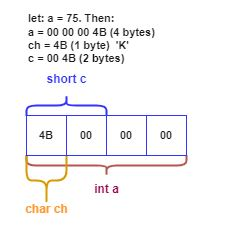

## Преговор. Указатели, референции, динамична памет.

### Създаване на променливи (в статичната и динамичната памет)

```c++
#include <iostream>

int main()
{ 
   int a = 10;		   // int in the stack
   int* ptr = new int(30); // int in the dyniamic memory (we use a pointer on the stack to point to the int)

   std::cout << "First number: " << a << " " << " second number: " << (*ptr) << std::endl;
   
   std::cout << "Address of second number" << ptr << std::endl;
   
   delete ptr; //!!! 
   
   ptr = &a;
   std::cout << "Address of first number" << ptr << std::endl;
   
   int& b = a; //another name for the variable
   b = 30;
   
   std::cout << "First number" << a << std::endl 

}
```

### Подаване на параметри във функция

Подаване по копие.
```c++
#include <iostream>

void f(int a)
{
   a++;
}

int main()
{
   int a = 10;
   f(a);
   std::cout << a << std::endl; //10
}
```

Подаване по референция.
```c++
#include <iostream>

void f(int& a)
{
   a++; //a++ will increment the pointer
}

int main()
{
   int a = 10;
   f(a);
   std::cout << a << std::endl; //11
}
```

Подаване по указател.
```c++
#include <iostream>
void f(int* a)
{
   (*a)++; //a++ will increment the pointer
}
int main()
{
   int a = 10;
   f(a);
   std::cout << a << std::endl; //Compilation Error
}
```

```c++
#include <iostream>
void f(int* a)
{
   (*a)++; //a++ will increment the pointer
}
int main()
{
   int a = 10;
   int *p = &a;
   f(a);
   std::cout << a << std::endl; //11
}
```

## Обектно-ориентирано програмиране

OОП е програмна парадигма.

Принципи:
- Абстракция
- Капсулация
- Наследяване
- Полиморфизъм

##  Структури (struct)
Структурите в C++ се използват за групиране на елементи.
Елементите, наричани още членове, могат да бъдат от различен тип и с различна дължина.

```c++
struct Point
{
       int x;
       int y;
}
```
 
###  Деклариране на обекти от новия тип
 ```c++
Point A; //default values to x and y

Point B = {3, 4} // x = 3, y = 4;

Point C;
C.x = -11;
C.y = -100;
```
	
###  Подаване във функции
Ако няма да променяме обекта го подаваме по **константна референция.**
 ```c++
//Eucledian Distance
int distance(const Point& q,const Point& p)
{
   	double dx = q.x - p.x;
	double dy = q.y - p.y;

	return sqrt(dx*dx + dy*dy);
}

```

Може и само по **референция**, но тогава промените ще се отразят върху подадения аргумент.
```c++
void readPoint(Point& D)
{
    cin >> D.x >> D.y;
}
```

Може и да го подаваме по **копие**.
```c++
Point revertPoint(Point F)
{
    int temp = F.x;
    F.x = F.y;
    F.y = temp;

    return F;
}
```

**Задача:** Въвежда се цяло число **N**  и после **N** тригъгълника в равнината, определени от 3 точки (6 координати).
Отпечатайте тригълниците **сортирани по лицата им.**


## Type punning 
```c++
int main()
{
	int a = 50;
	double value = a;
}

int main()
{
	int a = 50;
	double value = (double)a;
}
```

```c++
//Pretty Bad as they are different sizes

int main()
{
	int a = 50;
	double value = *(double*)&a;
}
```

```c++
struct Entity
{
	int x,y;
	
	int* GetPosition()
	{
		return &x;
	}
};

int main()
{
	Entity e = { 1, 2};
	int* position = (int*)&e;
	
	int y = *(int*)((char*)&e + 4);
	std::cout << y << std::endl;
}
```

## Обединения (union)

Използва едно и също място в паметта за всеки от своите членове.

```c++
union Example
{
	int a;
	char b;
}var;

int main()
{
	var.a = 65;
	std::cout << var.a << " " << var.b; // 65 A
}
```

```c++
union Example
{
	int a;
	char b;
	double c;
	float d;
};

int main()
{
	std::cout << sizeof(union Example); //8
}
```

```c++
union Example
{
	int a;
	char b;
}var;

int main()
{
	var.a = 90;
	union Example *p = &var;
	std::cout << p->a << " " << p->b; //90 Z
}
```


